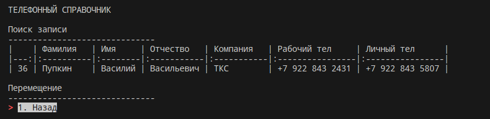
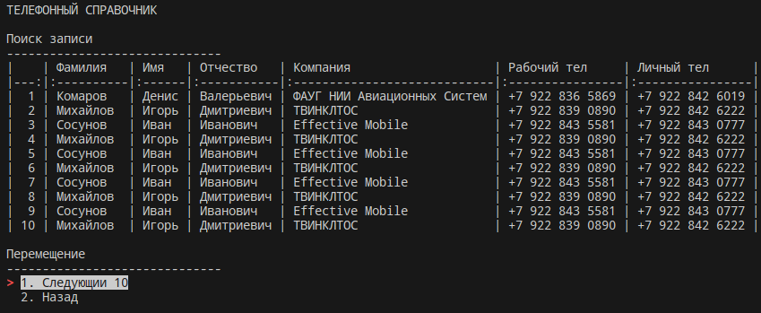

# Описание 
Программа для ведения телефонного справочника

## Функции

    1. Получить данные
    1.1 Вывод записей с использованием фильтров
    1.2 Вывод всех записей

    2. Добавить запись

    3. Редактировать данные
    3.1 Изменить запись
    3.2 Удалить запись
    3.3 Удалить все записи

## Экранные формы

### Главное меню


### Поиск записи


### Поиск записи -> Найти по совпадению


### Поиск записи -> Найти по совпадению -> Ввод данных


### Поиск записи -> Показать все записи


# Системные требования
1. Требуется терминал UNIX, LINUX или IOS. 


# Запуск системы

1. Виртуальное окружение 
```bash
pip install poetry --- установка poetry
poetry install --- установка зависимостей из файла pyproject.toml
poetry update --- обновление пакетов
```
2. Запуск программы
```
poetry shell --- запуск виртуального окружения
python3 tz_em/main.py --- запуск программы
```
